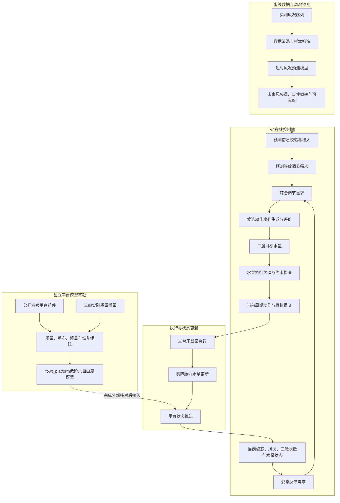

# 基于短时风况预测的浮式风机主动压载调节

## 当前版本与阅读入口（2026-10-06）

本次发布同步当前科研代码与研究规划。已经实现的是确定性预览MPC、来源绑定风载转换、实际水泵执行和滚动状态反馈；有限情景联合规划及低频区域分层目标仍处于设计/实施阶段，不能将规划文档当作已完成能力或新性能结论。

- 当前课题定位：[10.6课题规划](docs/10.6课题规划.md)。
- 后续实施顺序与接口：[有限情景主动压载执行规划](docs/10.6_有限情景主动压载_执行规划.md)。
- 已有工作与实际限制：[大论文执行记录](docs/thesis_execution_progress_20261005.md)、[预测到决策机制诊断](docs/thesis_prediction_decision_mechanism_diagnosis_20261005.md)。
- 文献来源与迁移边界：[全文精读评估](docs/recent_preview_control_fulltext_review_20261006.md)、[文献索引](references/multistage_control/README.md)。
- 代码入口：`src/wind_prediction/preview_mpc.py`、`src/wind_prediction/preview_mpc_control_cycle.py`、`scripts/validation/preview_mpc_continuous_experiment.py`。

公开仓库不包含本地虚拟环境、训练权重、原始实验数据、完整输出或机构授权论文PDF。依赖这些资料的真实数据回放不能仅凭仓库克隆复现。

## 当前Preview控制链

`预测风矢量及来源 → 同口径物理载荷 → 确定性预览规划 → 实际首块预演与达到状态 → 尾段重规划及候选选择 → 当前周期执行 → 实际状态反馈`

| 入口 | 职责 |
| --- | --- |
| [preview_mpc.py](src/wind_prediction/preview_mpc.py) | 控制导向预测模型与优化求解 |
| [preview_mpc_application.py](src/wind_prediction/preview_mpc_application.py) | 预测来源身份、输入装配与应用接口 |
| [preview_mpc_control_cycle.py](src/wind_prediction/preview_mpc_control_cycle.py) | 继续原目标、释放目标、新目标的比较；首块预演后从实际达到状态重算尾段 |
| [preview_mpc_runtime.py](src/wind_prediction/preview_mpc_runtime.py) | 执行能力包络、物理预演与周期执行 |
| [preview_mpc_continuous_experiment.py](scripts/validation/preview_mpc_continuous_experiment.py) | 共用连续回放与评价入口 |

实际泵送复用`execution_rollout.py`，平台推进复用`physical_execution_platform_path.py`。目标水量不等于下一周期实际水量；保持目标可能继续泵送，释放目标也不意味着瞬时停泵或撤销已经发生的水量变化。

后续有限情景与低频区域分层目标按10.6两份规划推进；它们的完成状态以对应实施记录为准，不因入口文档更新而视为已经完成。验证范围按当前规划和具体任务确定，不自动启动10、20、30组逐级试验，也不追逐历史节泵比例。

## 历史V2背景（2026年8月阶段）

以下内容保留早期V2的架构、命令及当时的验证边界，不代表当前Preview实现状态。新开发以上述Preview入口和10.6规划为准；旧路径仅在明确需要历史复现或对照时使用。

本仓库用于研究三舱半潜式浮式风机的预测辅助主动压载调节。系统利用历史风况预测未来短时风矢量和风况变化信息，并结合平台纵摇、横摇状态、压载舱实际水量及水泵状态，生成当前控制周期的三舱目标水量。

当时的工作重点不是继续追求某个固定的节泵比例，而是建立一条结构清楚、状态一致且能够追踪决策依据的研究链路。该阶段已经形成V2控制器框架和独立的低阶平台模型模块，但平台参数标定、三舱运行时连接及高保真交叉验证仍在推进。因此，该阶段的整链路结果主要用于检查信息传递和程序结构，不应直接作为新的工程性能结论。

## 历史V2架构



架构分为四部分：

1. **离线预测**：完成风况数据整理、预测样本构造、模型训练和预测证据输出。
2. **在线决策**：将姿态反馈与通过校验的预测信息放在同一调节尺度下，评价候选动作并提交唯一的目标水量。
3. **执行与反馈**：根据目标误差、泵流量和舱容边界推进三舱实际水量，再把更新后的状态交给下一控制周期。
4. **平台模型基础**：独立维护六自由度数学口径、参考平台矩阵及三舱质量属性。该模块已通过内部一致性检查，尚未替换当前整链路中的历史平台实现。

## 历史V2代码边界

### V2控制器

早期V2的公共接口从`wind_prediction.controller`导入；它不是当前Preview开发的唯一入口：

```python
from wind_prediction.controller import ForecastAssistedBallastController
```

一次控制周期接收当前姿态及角速度、当前风况、未来预测证据、三舱实际质量、水泵状态和上一周期保留目标，返回：

- 当前选择的动作及目标操作；
- 已经过候选评价的三舱目标水量；
- 当前决策时段的水泵执行预演；
- 下一周期控制器状态；
- 预测使用情况、候选得分、目标误差和约束状态等决策记录。

控制器只有一个候选评价入口和一个最终目标提交点。任何在评价后发生变化的动作或目标，都必须重新评价后才能进入执行层。

### 低阶平台模型

`src/fowt_platform/`采用静平衡附近的小角度增量六自由度口径，当前已实现：

- 质量、阻尼、静水恢复和局部线性系泊矩阵的独立保存与检查；
- 气象风向、地理坐标和平台坐标之间的转换；
- VolturnUS-S公开参考组件读取；
- 三舱质量变化引起的总质量、重心、惯量和重力矩更新；
- 静态增量偏移、模态和固定参数自由响应检查。

该模块目前属于平台模型数学基础。绝对静平衡、阻尼标定、正式风浪载荷、三舱与水泵的运行时连接，以及OpenFAST或RAFT外部核对尚未全部完成。

### 历史兼容路径

`ballast_planner_provider.py`、`provider_*.py`、`ballast_planner.py`和`provider_factory.py`保留用于复现已投稿小论文流程和历史证据。它们不属于V2公共控制接口，后续不再向其中增加新的控制分支。

## 历史V2目录结构

```text
.
├── src/
│   ├── wind_prediction/
│   │   ├── controller.py                 # V2公共接口
│   │   ├── controller_core.py            # 需求形成、候选评价与最终决策
│   │   ├── controller_runtime.py         # 单周期推进及跨周期状态
│   │   ├── forecast_evidence.py          # 预测证据校验
│   │   ├── forecast_action_policy.py     # 预测动作准入规则
│   │   ├── ballast_allocation.py         # 纵横摇需求到三舱目标的分配
│   │   ├── execution_rollout.py          # 三泵执行预演
│   │   ├── controller_plant_adapter.py   # 控制器与现有执行链适配
│   │   └── provider_*.py                 # 小论文历史兼容路径
│   └── fowt_platform/
│       ├── incremental.py                # 增量六自由度模型
│       ├── reference.py                  # 公开参考平台组件
│       ├── ballast.py                    # 三舱质量属性与广义载荷
│       ├── ballast_snapshot.py           # 实际水量到平台快照的单一装配入口
│       ├── coordinates.py                # 风向与坐标转换
│       ├── modal.py                      # 模态分析
│       └── free_response.py              # 固定参数自由响应
├── configs/                              # 控制、平台和验证配置
├── scripts/
│   ├── data_preparation/                 # 风况数据与预测样本构造
│   ├── modeling/                         # 预测模型训练和基线评价
│   ├── validation/                       # 控制链、平台和协议检查
│   ├── analysis/                         # 结果分析与审计脚本
│   └── paper_figures/                    # 论文图表脚本
├── tests/                                # 单元、接口、结构和回归测试
├── docs/                                 # 架构、物理口径与验证说明
├── archive/                              # 旧版平台与历史实现
└── outputs/                              # 本地运行结果，不作为源码提交
```

## 历史V2候选动作含义

V2控制器评价的是目标水量更新方式，不是固定的水泵流量档位：

- `strengthen`：增大当前方向的目标调整幅度；
- `normal`：按常规幅度更新目标；
- `reduced`：减小目标调整幅度；
- `continue_target`：保持尚未完成的既有目标；
- `release_target`：将目标释放至当前实测舱内水量；
- `reverse`：沿相反补偿方向生成新目标。

水泵实际流量由目标误差、最大流量、舱容和泵状态另行确定。预测相关的高影响动作只有在预测证据满足准入条件时才能参与评价。

## 历史V2冒烟检查

以下命令用于旧接口复现，不是有限情景研究版本的运行说明。当前Preview实验及其数据要求见顶部执行规划。

推荐使用Python 3.12。已有本地环境时，可直接使用`.venv312`：

```bash
python3.12 -m venv .venv312
source .venv312/bin/activate
pip install -r requirements.txt
```

运行V2控制器确定性冒烟检查：

```bash
PYTHONPATH=src .venv312/bin/python3.12 \
  scripts/validation/run_controller_core_smoke.py
```

该检查输出三个连续控制周期的预测来源、候选排序、所选动作、目标水量和水泵预演状态，只用于验证控制器接口和状态推进。

运行完整测试：

```bash
PYTHONDONTWRITEBYTECODE=1 PYTHONPATH=src \
  .venv312/bin/python3.12 -m unittest discover -s tests -p 'test_*.py'
```

截至2026年8月13日，仓库共464项测试通过。其中旧链路兼容性测试会主动构造系泊文件缺失情形，因此会出现4条线性替代警告；新平台模块不采用这种静默回退。

## 历史V2配置与可追踪性

V2控制器推荐配置入口为`configs/controller_core_v2.json`。配置读取器会拒绝未知字段、检查参数之间的约束，并为归一化后的有效配置生成SHA-256摘要。

每次正式运行还应记录：

- 输入数据和工况清单；
- 预测模型名称、版本及预测来源；
- 控制器和平台配置摘要；
- 每周期预测准入、候选排序、最终动作和目标水量；
- 水泵实际执行量、未完成目标误差及约束触发情况；
- 源码提交号和结果文件摘要。

这些记录用于区分预测信息、候选动作结构和执行器限制各自对结果的影响。

## 历史V2验证边界

该阶段已经确认：V2控制接口能够运行，预测内容能够进入候选评价，评价后的目标能够原样传递至执行链，三舱状态和跨周期目标能够连续更新。上述结果属于当时的框架与机制检查。

以下为该历史阶段尚未完成的内容；当前进度应查阅顶部实施记录，而不是将此清单作为新任务：

1. 新低阶平台模型对当前历史平台实现的正式替换；
2. 绝对静平衡、阻尼、波浪载荷和三线系泊模型标定；
3. 三舱独立进排水引起的总压载量、吃水、动量通量和自由液面效应评估；
4. 与OpenFAST或RAFT的代表性响应交叉核对；
5. 在更广泛连续风况下形成新的控制性能结论。

小论文阶段的150组结果属于已冻结历史流程的证据，不是V2控制器的回归目标，也不用于证明当前平台模型已经具备工程精度。

## 数据和生成结果

原始风况、处理后数据集、模型权重、论文图片和批量仿真结果不作为源码主体提交。可复现实验应通过配置文件、输入清单、模型身份、Git提交号和摘要文件定位数据，而不是依赖某个未说明来源的输出目录。

进一步说明见：

- [V2控制器框架](docs/controller_v2_framework.md)
- [P1平台模型数学与物理口径](docs/p1_math_contract_reference_platform_decision.md)
- [P2低阶平台模型实施状态](docs/p2_platform_model_status.md)
- [验证协议V2](docs/validation_protocol_v2.md)
