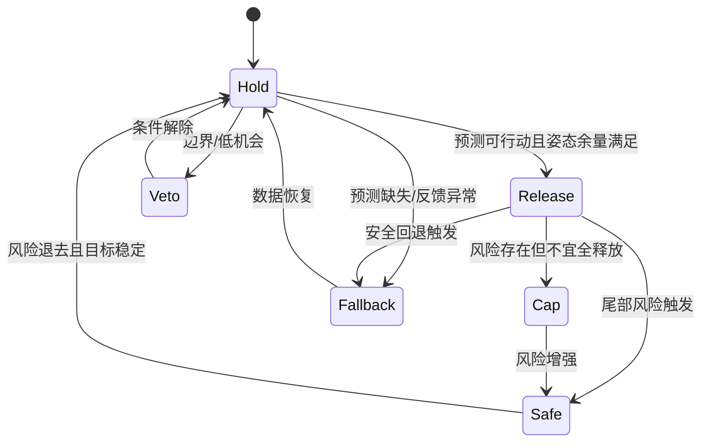

# 浮式风机主动压载小论文重写与执行规划

## 执行摘要

综合你当前锁定的论文框架、修订总规划、现稿、宋梓豪控制类小论文，以及三篇可公开获取的相近控制论文后，可以得出一个明确结论：这篇稿件最适合被写成**“短时风况预测辅助的主动压载上层协调调节”**小论文，而不是风况预测精度竞赛论文、严格最优控制论文，或长期部署级控制器认证论文。正文结构应维持锁定的紧凑工程短论文体例：**0引言—1上层协调调节方法—2预测与风险识别方法—3仿真验证与结果分析—4结论**；用户此次提出的“3仿真验证、4结果”两章需求，建议吸收为第3章内部二级小节，而不要打破当前冻结结构。fileciteturn0file0 fileciteturn0file1

三类修改方向最值得执行。其一，**完全采纳** 5.5pro 关于证据边界、图1重画、预测不直接输出泵命令、所有节泵结果同步报告姿态代价的意见；其二，**部分采纳** 5.5pro 关于方法数学化的意见，但必须改写为“有限候选动作 + 门控评分 + 目标生命周期管理 + 执行约束”，不能虚构成连续变量在线优化器；其三，**明确反驳** 将方法缩小成单纯“约束调节方法”的改题方向，因为你当前锁定的方法对象是“模式选择 + 目标管理 + 边界拒绝 + 安全回退”的上层协调层，而不是普通 deadband/budget 调参器。fileciteturn0file1 fileciteturn0file3

从对比样本看，宋梓豪论文的长处在于“问题—模型—控制目标—控制律—稳定性/约束—仿真指标”链条非常清楚；Al 等关于浮式风机波浪前馈控制的论文，则把“现有控制器 + 新增预览通道”的边界写得非常清楚；Walker 与 Giorgio-Serchi 的波扰预览 NMPC 论文，把“预测器如何进入闭环”写成了模块接口；Liu 等关于故障诊断 + 预测重复控制的论文，则提供了“上层识别—切换—下层执行”的分层写法模板。对你最有价值的，不是照搬他们的控制律，而是学习其**模块职责、状态变量、切换条件、证据边界**的写法。fileciteturn0file2 citeturn13view0turn13view1turn14view0

## 核心对比结论

当前现稿已经具备三个可保留的骨架：一是“未来60 min 风况—三段风险窗—压力代理—上层调节—闭环反馈—执行约束”的控制链路；二是“压力代理”“风险窗口”“动作预算/死区/权重”这些可数学化的接口变量；三是“6 h casebook 与 12 h 边界披露”的验证意识。真正需要补的，不是再加更多概念，而是把这些概念重写成**输入—输出—判定—更新—执行**的工程接口。fileciteturn0file3 fileciteturn0file0

与相近控制论文相比，你的稿件最欠缺的不是公式数量，而是**公式与模块职责的一一对应**。宋梓豪论文在方法部分先定义跟踪目标、误差向量、滑模面、控制律与自适应律，再单列饱和约束和性能评估函数，因此读者能直接判断“每个公式在做什么”；Al 等和 Walker 等论文也都把“原反馈控制器保留、预览信息作为新增通道”写得很清楚。你的方法章应沿着同一路径改写：先定义输入状态，再给出风险门控和动作选择，再写目标生命周期，再写执行层，而不是直接从“低风险保持、高风险提前调节”讲起。fileciteturn0file2 citeturn13view0turn13view1

下表给出最值得借鉴的四种写法模式。表中“可借鉴点”不是让正文去改写成对方方法，而是借用其**论文表达骨架**。判断依据综合自宋梓豪论文、当前现稿、锁定框架与三篇公开论文。fileciteturn0file0 fileciteturn0file2 fileciteturn0file3 citeturn13view0turn13view1turn14view0turn14view1

| 来源 | 典型写法模式 | 对本文最可借鉴的点 | 不宜照搬的点 |
|---|---|---|---|
| 宋梓豪 ASTSMC 小论文 | 先建模，再给控制目标、误差定义、控制律、约束、性能指标 | 方法章先给“目标—变量—控制律/规则—指标”链条；图先于结果，表先于参数 | 你的方法不是单个鲁棒控制律，不宜硬造 Lyapunov 与有限时间收敛证明 |
| Al 等 FOWT 前馈控制 | “在原控制器基础上补充前馈/预览通道” | 摘要和引言中明确“补充已有闭环，而非替代” | 不能把你的上层协调层降成简单 feedforward 通道 |
| Walker 波扰预览 NMPC | 预测器 + 状态估计 + 闭环策略构成完整链路 | 第2章写“预测信息如何变为控制可读输入”，第1章写“如何被控制层消费” | 你的代码若非 NMPC，就不能借用其最优控制口径 |
| Liu 故障诊断 + SPRC | 上层识别/切换 + 下层控制执行 | 很适合借鉴“boundary / fallback / veto / release”的分层写法 | 不能写成故障诊断式切换律，除非正文确有对应机制 |

## 术语、证据口径与章节结构的最终选择

当前冻结文件已经给出明确约束：正文不再使用导师禁用的旧术语，统一改用“上层决策”“上层调节”“预测辅助调节”“上层协调调节”等表达；同时严禁把方法改写成“预测驱动水泵”或“严格 MPC/QP 在线优化器”。因此，术语上最稳妥的组合不是简单恢复“监督”，也不是被 5.5pro 压缩成“约束调节”，而是：**题名和正文主词用“上层协调调节”，在方法描述中保留其 supervisory function，即模式选择、目标管理与边界协调的上层角色**。fileciteturn0file1

证据口径方面，旧稿中的 22.48%、29.04%、20.58% 属于历史草稿或历史分层结果，而当前冻结总规划已将正文 headline 更新为 **guard10 6 h paired casebook 中累计泵量降低 6.01%，\(t>5^\circ\) 减少 64 s，\(t>7.5^\circ\) 减少 44 s，\(t>10^\circ\) 不增加**；12 h gain=0.45 的 9.51% 仅作鲁棒性披露。故本轮重写应以**写法层面**吸收 5.5pro 建议，但在**数字层面**以冻结证据表为准。fileciteturn0file1

| 争议项 | 5.5pro 建议 | 当前建议 | 采纳级别 |
|---|---|---|---|
| “监督”一词 | 全部删除 | 正文不用旧术语，但保留“上层协调/模式选择/目标管理”的 supervisory 含义 | 部分采纳 |
| 题名改成“约束调节方法” | 缩窄题名 | 反对；推荐“短时风况预测辅助的主动压载上层协调调节方法” | 反驳 |
| 写成显式 \(J(a)\) 优化 | 强化数学感 | 仅保留“有限候选动作评分/选择”写法，不写连续优化器 | 部分采纳 |
| 第2章改成纯验证方案 | 压缩方法章 | 反对；第2章仍保留预测与风险识别，只是不写成精度竞赛 | 反驳 |
| 图1重画为闭环接口图 | 明确链路 | 应直接执行 | 采纳 |
| 所有节泵同时报姿态代价 | 强化边界 | 应直接执行 | 采纳 |

## 逐章执行方案

### 摘要

摘要建议严格按“应用场景—问题—方法—链路边界—冻结证据—边界句”六句式写。第一句写浮式风机主动压载依赖当前反馈、对短时风况预判利用不足；第二句写提出“短时风况预测辅助的主动压载上层协调调节方法”；第三句写预测输出未来风矢量、分段风险窗、风况事件和压力代理；第四句写预测信息进入上层决策接口，不直接输出泵命令，原闭环反馈与执行安全层保持不变；第五句只写当前冻结 6 h paired headline；第六句用一句话锁死证据边界。这个写法与宋梓豪论文“针对…提出…通过…验证…”和 Al 等“conventional controller is complemented with…”的摘要边界一致。fileciteturn0file2 fileciteturn0file1 citeturn13view0

可直接替换为如下骨架句：
“针对浮式风机主动压载主要依赖当前姿态反馈、对短时未来风况变化利用不足的问题，提出一种短时风况预测辅助的主动压载上层协调调节方法。该方法以历史风况窗口为输入，预测未来60 min风矢量，并构造0–20、20–40 和 40–60 min 三段风险窗口、风况事件标志及压力代理信号；上述信息用于上层决策接口中的工况识别、目标保持/释放、动作限幅与安全回退，而不直接生成水泵命令。原闭环反馈控制器、水泵执行约束和安全保护逻辑保持不变。在冻结的 6 h episode-level paired casebook 中，预测辅助上层协调调节策略相对无预测闭环反馈策略累计泵量降低 6.01%，\(t>5^\circ\) 减少 64 s、\(t>7.5^\circ\) 减少 44 s、\(t>10^\circ\) 不增加。结果表明，短时风况预测可在短时冻结工况窗口中减少部分不必要泵送，并保持严重姿态暴露指标有界。”fileciteturn0file1

### 引言

引言不要单独发展成长文综述，而应像宋梓豪论文那样在三到四段内完成“工程对象—现有不足—本文方法—贡献边界”闭环。第一段写浮式风机在风浪流与系泊耦合下存在低频姿态响应，主动压载是可用执行手段；第二段写当前主动压载多依赖当前姿态或平均载荷反馈，对未来短时风况预览利用不足；第三段写短时风况预测可以提供趋势、分段风险窗和事件预警，因此适合作为上层协调信息，而不是直接执行控制器；第四段写本文贡献与证据边界。fileciteturn0file0 fileciteturn0file3

引言末段可采用如下句式：
“本文研究的重点不在于短时风况预测模型精度竞赛，也不在于长期部署级控制器认证，而在于短时风况信息如何作为上层决策接口进入主动压载控制链路。为此，本文建立未来风矢量—风险窗口—压力代理—目标生命周期管理的协调调节框架，并在冻结的 6 h paired casebook 中评价其节泵收益与姿态边界，同时利用 12 h mixed-regime 结果披露适用边界。” 这种“先交代不做什么，再交代做什么”的方式，与 Walker 论文在摘要中先写波扰环境，再写 predictor + EKF + router into NMPC 的路径一致。fileciteturn0file1 citeturn13view1

### 方法章

方法章应是全文主轴，建议固定为四个二级小节：控制链路与上层决策接口、决策状态与风险门控逻辑、压载目标生命周期管理、压载目标生成与水泵执行约束。当前现稿已有压力代理式和状态表，但缺失明确的输入输出和“进入下一模块条件”。因此第1章必须补上一张模块接口表，并把公式按模块放置。fileciteturn0file3 fileciteturn0file0

建议使用下表作为方法章核心接口表。表中符号按你最新默认实现模型整理，保持“有限候选动作 + 门控评分 + 执行约束”口径，不虚构连续优化器。

| 模块 | 输入 | 输出 | 判定/进入条件 | 建议公式 |
|---|---|---|---|---|
| 风况预览输入 | 历史风况 \(X_t\) | 未来风矢量 \(\hat Y_t\) | 窗口完整 | \((\hat Y_t,\hat p_t)=f_\Theta(X_t)\) |
| 风险识别 | \(\hat Y_t,\hat p_t\) | \(R_{1:3,t}\) | 三段窗口可计算 | \(R_{k,t}=\mathcal R(\hat Y_{t,j\in B_k},\hat p_{t,k})\) |
| 压力代理 | \(\hat Y_t\) | \(q_{1:3,t}\) | 代表风矢量有效 | \(q_k=\mathcal Q(\hat Y_{t,j\in B_k})\) |
| 状态融合 | \(R_{1:3,t},q_{1:3,t},z_t,h_t\) | \(\chi_t\) | 反馈状态有效 | \(\chi_t=\{R_{1:3,t},q_{1:3,t},z_t,h_t\}\) |
| 上层动作选择 | \(\chi_t\) | \(s_t\) 或 \(\mathbf a^*\) | 预测可信且未触发 fallback | \(s_t=\mathcal G(\chi_t)\) 或 \(\mathbf a^*=\arg\min_{\mathbf a\in\mathcal A^3_{\text{feasible}}}S(\mathbf a)\) |
| 目标生命周期 | \(m_{t-1}^*,m_{fb,t},s_t,z_t\) | \(m_t^*\) | 允许更新目标 | \(m_t^*=\mathcal T(m_{t-1}^*,m_{fb,t},s_t,z_t)\) |
| 执行层 | \(m_t^*,m_t\) | \(\dot m^{cmd}_{i,t}\) | 满足舱容/滞回/流量限制 | \(\dot m^{cmd}_{i,t}=\text{sat}\!\left(\frac{m_{i,t}^*-m_{i,t}}{\Delta t}\right)\) |

第1章正文可用三组核心公式。第一组是**状态与门控**：
\[
\chi_t=\{R_{1:3,t},q_{1:3,t},z_t,h_t\},\quad
s_t\in\{\text{hold},\text{release},\text{cap},\text{veto},\text{safe},\text{fallback}\}.
\]
第二组是**有限候选动作评分**：
\[
S(\mathbf a)=
w_p C_{\text{pump}}+w_a C_{\text{att}}+w_s C_{\text{switch}}+w_b C_{\text{barrier}}+C_{\text{hard}},
\]
并立刻加一句：“上式仅用于概括有限候选动作序列的工程选择，不表示本文实现了连续变量在线优化或严格 MPC/QP 求解。” 第三组是**目标生命周期与执行约束**：
\[
m_t^*=\mathcal T(m_{t-1}^*,m_{fb,t},s_t,z_t),\qquad
\dot m^{cmd}_{i,t}
=\operatorname{sat}\!\left(\frac{m_{i,t}^*-m_{i,t}}{\Delta t},-\dot m_i^{\max},\dot m_i^{\max}\right).
\]
这样既保住数学化程度，又忠实于当前锁定写法。fileciteturn0file1 fileciteturn0file3

### 预测与风险识别章

第2章不要被删成“数据准备”。这是本文方法的一半，因为控制链路真正需要的是“如何把预测信息变成控制可读变量”。建议四个二级小节固定为：FINO1 风况数据与输入特征构造、未来风矢量预测、分段风险窗口与风况事件识别、压力代理与调节接口输出。这个安排与当前锁定框架完全一致。fileciteturn0file0 fileciteturn0file1

数学化重点放在三个公式。第一，风矢量预测：
\[
X_t=\{x_{t-L+1},\ldots,x_t\},\qquad
\hat Y_t=\{(\hat u_{t+j},\hat v_{t+j})\}_{j=1}^{F}.
\]
第二，分段窗口：
\[
B_1=\{0\!-\!20\text{ min}\},\quad
B_2=\{20\!-\!40\text{ min}\},\quad
B_3=\{40\!-\!60\text{ min}\}.
\]
第三，风险信号与压力代理：
\[
R_{k,t}=\mathcal R(\hat Y_{t,j\in B_k},\hat p_{t,k}),\qquad
q_k=s_q
\begin{bmatrix}
-d_\theta \rho_k\cos\bar\alpha_k\\
d_\phi \rho_k\sin\bar\alpha_k
\end{bmatrix}.
\]
这里必须明确：\(q_k\) 是**控制接口变量**，不是真实气动载荷或完整平台力矩。这个边界在现稿中尚不够清楚，需要加严。fileciteturn0file3

### 验证与结果章

按照锁定结构，建议把用户所说“第3章仿真验证”和“第4章结果”合并为正文第3章内部的 3.1–3.4。3.1 写平台模型、对比策略和 raw 1 Hz 指标；3.2 写当前冻结 6 h production-near paired 主结果；3.3 写 prediction-actionable、boundary 和 low-opportunity 分层解释；3.4 写 12 h gain=0.45 robustness disclosure。fileciteturn0file0 fileciteturn0file1

第3章的数学对象不是控制律，而是**评价口径**。建议固定三式：
\[
\psi(t)=\max(|pitch(t)|,|roll(t)|),
\]
\[
T_{\psi>\gamma}=\int_{t_0}^{t_0+T}\mathbf 1\{\psi(t)>\gamma\}\,dt,\quad \gamma\in\{5^\circ,7.5^\circ,10^\circ\},
\]
\[
\eta_P=\frac{P_{\text{base}}-P_{\text{cand}}}{P_{\text{base}}}\times 100\%.
\]
并在3.1中给出阈值语义：\(5^\circ\) 是 service-pressure band，不是 hard failure；\(7.5^\circ\) 与 \(10^\circ\) 分别表征较大和严重尾部暴露。该做法与你当前总规划完全一致，也与控制论文常见的“性能指标明确定义后再读图表”的写法一致。fileciteturn0file1 fileciteturn0file2

### 结论

结论只能保留四点：一是方法定位；二是 6 h headline 证据；三是 prediction-actionable 只作机制支撑；四是 12 h/24 h 的边界与后续工作。宋梓豪论文的结论很短，只回到“提出了什么、验证了什么”，这一点非常值得借鉴。你的稿件不应在结论中再次扩展分层细节，更不能把 12 h、historical branches 或旧草稿大数字写成统一 headline。fileciteturn0file2 fileciteturn0file1

## 数学化方法模板

下面这一页模板可以直接作为第1章的重写蓝本。它的目标不是替代你真实代码，而是把“有限候选动作 + 门控评分 + 目标生命周期 + 执行约束”的程序事实翻译成工程论文语言；若后续细节仍缺，继续按你给定的默认实现模型处理即可。

```math
\text{输入：}\quad X_t,\ z_t,\ h_t
```

```math
(\hat Y_t,\hat p_t)=f_\Theta(X_t)
```

```math
R_{k,t}=\mathcal R(\hat Y_{t,j\in B_k},\hat p_{t,k}),\qquad
q_k=\mathcal Q(\hat Y_{t,j\in B_k}),\quad k=1,2,3
```

```math
\chi_t=\{R_{1:3,t},q_{1:3,t},z_t,h_t\}
```

```math
\mathbf a^*
=\arg\min_{\mathbf a\in\mathcal A^3_{\mathrm{feasible}}}S(\mathbf a)
\quad\text{或}\quad
s_t=\mathcal G(\chi_t)
```

```math
m_t^*=\mathcal T(m_{t-1}^*,m_{fb,t},s_t,z_t)
```

```math
\dot m^{cmd}_{i,t}
=\operatorname{sat}\!\left(
\frac{m_{i,t}^*-m_{i,t}}{\Delta t},
-\dot m_i^{\max},\dot m_i^{\max}
\right)
```

```text
伪代码
Input: 历史风况窗口 X_t, 当前平台状态 z_t, 目标生命周期状态 h_t
1: 计算未来风矢量与事件概率 (\hat Y_t, \hat p_t)
2: 生成三段风险窗口 R_1:R_3 与压力代理 q_1:q_3
3: 形成融合状态 χ_t
4: 若预测缺失/边界触发，则进入 fallback 或 veto
5: 否则在有限候选动作集合中评分并选取第一段动作
6: 基于目标生命周期逻辑生成/保持/释放/限幅 m_t^*
7: 经水泵执行约束得到实际泵流量
8: 更新平台姿态、舱水量、目标状态并进入下一周期
```



## 图表清单与图一重画建议

图表布局建议遵循“接口图—代表窗口—paired aggregate—姿态代价—边界披露”的顺序。图1必须重画；代表曲线只能解释机制，不能替代 paired aggregate；主结果必须锚定表格与成对分布图。当前总规划对图1、图3、图4、图6的职责已经很清楚，建议直接沿用。fileciteturn0file1

| 图表 | 作用 | 必须包含的元素 |
|---|---|---|
| 图1 控制链路与接口图 | 说明预测如何进入控制链路 | 数据流、控制流、反馈流；不得出现“预测模型→水泵命令” |
| 图2 代表性 6 h episode | 解释机制 | 风况、姿态、目标舱水量、泵流量、累计泵量；注明 raw 1 Hz 指标、平滑仅展示 |
| 图3 6 h paired 主结果 | headline | 单窗口对比 + 累计泵耗双面板 |
| 图4 姿态代价图 | 边界披露 | \(t>5^\circ\)、\(t>7.5^\circ\)、\(t>10^\circ\)、pitch/roll p95 |
| 图5 收益—姿态代价散点图 | 解释 trade-off | 横轴泵耗变化，纵轴阈值暴露变化，区分 actionable / boundary / low-opportunity |
| 表1 模块接口表 | 方法章核心表 | 模块输入、输出、判定条件、建议公式 |
| 表2 casebook 冻结说明表 | 证据边界 | 6 h headline、12 h robustness、historical/specialist 角色 |
| 表3 成对比较模板 | 结果章核心表 | base、candidate、delta、role |

图1可直接按下面的 Mermaid 草图重画，之后再转成论文绘图软件版本：

```mermaid
flowchart LR
    X[历史风况窗口 X_t] --> F[未来风矢量预测 (\hat Y_t,\hat p_t)]
    F --> R[三段风险窗口 R_1,R_2,R_3]
    F --> Q[压力代理 q_1,q_2,q_3]
    Z[当前姿态/舱水量/泵状态 z_t] --> G[上层决策接口\n有限候选动作评价/门控评分]
    H[目标生命周期状态 h_t] --> G
    R --> G
    Q --> G
    G --> T[目标生命周期管理]
    FB[原闭环反馈目标 m_fb,t] --> T
    T --> M[目标舱水量 m_t*]
    M --> E[水泵执行约束\n舱容/流量/滞回/最小开停时间]
    E --> P[平台姿态与泵量响应]
    P --> Z
```

图注推荐写法：
“图1 短时风况预测辅助的主动压载上层协调调节信息流与控制接口。预测模块输出未来风矢量、分段风险和压力代理；上述信息与平台状态在上层决策接口中融合，用于目标保持/释放/拒绝/限幅/回退管理。实际泵流量仍由原闭环反馈控制器和水泵执行约束共同决定。”

## 需补充信息与优先参考文献

下面这些信息若能补齐，能显著降低改写过程中的歧义。P0 是正文必须锁定的，P1 是最好补充的，P2 是附录级补充。

| 优先级 | 需补充信息 | 影响部分 |
|---|---|---|
| P0 | 当前最终题名、是否完全采用“上层协调调节” | 摘要、首页、图题 |
| P0 | 冻结 headline 是否仍为 guard10 6 h 6.01% | 摘要、结果、结论 |
| P0 | 第3章是否允许保留 “3.1验证 + 3.2–3.4结果” 合章结构 | 全文目录 |
| P0 | target lifecycle 中“保持/释放/回退/拒绝”的最终术语 | 方法章、图1 |
| P1 | 如果公开，可否写出 block 长度与动作集合规模 | 方法公式、伪代码 |
| P1 | fallback 与 veto 的触发条件是否需要列成表 | 方法章、附录 |
| P1 | 结果图中是否补 pitch/roll p95 与 target/latch 行为 | 第3章图表 |
| P2 | 预测模型 MAE/角度误差/事件识别 F1 是否进附录 | 第2章或附录 |

优先参考文献建议分两组阅读。第一组是直接服务写作骨架的：宋梓豪 ASTSMC 小论文、当前冻结框架、修订总规划、现稿。第二组是借写法而不是借控制律的：Al 等关于 FOWT 波浪前馈控制、Walker 与 Giorgio-Serchi 的波扰预览 NMPC、Liu 等的故障诊断 + 预测重复控制，以及 Liu/Ferrari/van Wingerden 的 constrained SPRC。前两者教你如何写“预览信息进入现有闭环”；后两者教你如何写“上层识别/切换—下层执行”的分层控制。fileciteturn0file0 fileciteturn0file1 fileciteturn0file2 fileciteturn0file3 citeturn13view0turn13view1turn14view0turn14view1

参考文献清单建议如下：宋梓豪《不确定干扰下水面拖曳系统直线航迹跟踪控制》；当前冻结文件《当前小论文框架记忆》与《小论文修订总规划》；Al 等《Feedforward control for wave disturbance rejection on floating offshore wind turbines》；Walker 与 Giorgio-Serchi《Disturbance Preview for Nonlinear Model Predictive Trajectory Tracking of Underwater Vehicles in Wave Dominated Environments》；Liu 等《Fast Adaptive Fault Accommodation in Floating Offshore Wind Turbines via Model-Based Fault Diagnosis and Subspace Predictive Repetitive Control》；Liu 等《Periodic Load Rejection for Floating Offshore Wind Turbines via Constrained Subspace Predictive Repetitive Control》。fileciteturn0file0 fileciteturn0file2 citeturn13view0turn13view1turn14view0turn14view1