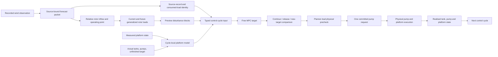

# FOWT prediction-assisted ballast control architecture and roadmap

Date: 2026-09-04

Paused-work checkpoint and exact resume order: `docs/fowt_reconstruction_handoff_20260905.md`.

## 1. Current system identity

The active research path is a deterministic linear preview-MPC prototype for
slow three-tank ballast redistribution.  It uses real LSTM wind-vector
forecasts, a source-bound quasi-steady rotor-load approximation, a small-angle
incremental platform model, a convex preview optimizer, and a physical
first-block pump execution check.  A separate outer decision compares whether
to continue the existing target, release it to the actual tank state, or adopt
the new MPC target.  Only the selected first control block is submitted.  The
next cycle is replanned from the simulated realised tank, pump, and platform
state under a full-state-feedback assumption.

This identity is deliberately narrower than a complete engineering controller.
The current system is not nonlinear MPC, robust or stochastic MPC, dynamic
ROSCO, a full variable-mass marine model, or an all-weather FOWT simulator.

## 2. End-to-end architecture



The architecture contains six Modules with explicit Interfaces:

1. **Forecast evidence Module**: binds one replay observation to one LSTM
   forecast and records the exact source identity.
2. **Rotor input Module**: converts current and future wind into relative
   inflow, nominal below-rated operating points, and generalized rotor loads.
3. **Platform Module**: provides the cycle-local small-angle incremental model
   and updates mass properties from actual three-tank water masses.
4. **Preview decision Module**: constructs and solves the convex QP over two
   zero-net differential ballast modes.
5. **Execution Module**: checks the first move against the actual pump state,
   executes one block, and returns reached tank and platform states.
6. **Experiment Module**: freezes cases, variants, source records, environment,
   metrics, and implementation identity without changing controller behavior.

The old rule-based controller and provider stack remain compatibility
Implementations and baselines.  New MPC behavior must not be added through
those paths.

### Active-path ownership map

| Responsibility | Active implementation | Design rule | Current decision |
|---|---|---|---|
| Real LSTM inference and replay binding | `scripts/validation/real_lstm_preview_fixture.py` | Infer once per origin and preserve the exact consumed record | Retain; experiment-facing adapter |
| Source-bound wind-to-rotor preview | `src/wind_prediction/source_bound_rotor_preview.py` | Wind facts remain independent of controller variant state; relative inflow and loads are derived explicitly | Retain |
| Relative inflow and rotor load conversion | `forecast_rotor_inflow.py`, `forecast_physical_load.py` | Reliability never changes physical load magnitude; operating-domain status is explicit | Retain within the declared below-rated scope |
| Cycle-local plant assembly | `src/wind_prediction/preview_mpc_application.py` | One source identity, one platform snapshot, one actuator envelope, and one typed cycle input | Retain as the public application entry |
| Working control design | `src/wind_prediction/preview_mpc_design.py` | Priorities, posture limits, working scope, and status are serialized separately | Retain; values are working parameters, not an optimum |
| Convex preview optimization | `src/wind_prediction/preview_mpc.py` | Full horizon is predicted, only the first move may be committed | Retain; no claim of robust or nonlinear MPC |
| Target lifecycle decision | `src/wind_prediction/preview_mpc_control_cycle.py` | Continue, release, and new target are compared from one common initial state | Retain as the only active selector |
| First-block feasibility check | `src/wind_prediction/preview_mpc_runtime.py` | Use actual latch, dwell, ramp, capacity, and unfinished-target state | Retain feasibility helpers; do not restore its legacy selector |
| Pump execution | `src/wind_prediction/execution_rollout.py` | Requested target, rate-limited target, actual mass, and remaining error are distinct | Retain |
| Pump-to-platform propagation | `physical_execution_platform_path.py`, `src/fowt_platform/ballast_snapshot.py` | Actual reached masses update platform properties and the next cycle state | Retain within the slow variable-mass approximation |
| Single-cycle experiment adaptation | `scripts/validation/preview_mpc_experiment_runtime.py` | Translate source records and serialize diagnostics without changing control behavior | Consolidated; keep outside the controller package API |
| Continuous cases and aggregation | `scripts/validation/preview_mpc_continuous_experiment.py` | Stop and exclude unsupported cycles; aggregate only completed comparable cases | Consolidated |
| Command-line entry points | `run_real_lstm_preview_mpc_rolling_semantic.py`, `run_preview_mpc_forecast_value_6h.py` | Parse arguments and write results only | Thin compatibility wrappers |
| Parameter screening | `run_preview_mpc_parameter_study.py`, `run_preview_mpc_stage10_screening.py` | Cases and candidates are fixed before execution; no per-case tuning | Retain but do not run before semantic and model-scope checks pass |
| Legacy rule and endpoint chains | `physical_lifecycle_*`, old provider and smoke paths | Historical reference only | Remove from the active public surface; do not extend |

## 3. Non-negotiable contracts

- A source record is inferred once.  Preflight and execution consume the same
  immutable forecast facts rather than independently rerunning the model.
- Record scope is explicit.  Warm-up and terminal records require only current
  observations; active control records require the forecast leads actually
  consumed by the selected planner horizon.
- Forecast reliability and event probability may affect admission or decision
  policy, but must not scale a physical wind or rotor load.
- Coordinate frame, wind-direction convention, heading, load application point,
  units, and sign conventions remain explicit at each conversion Interface.
- Current measured tank masses, the outstanding execution target, planned
  reachable tank motion, and the newly requested target are distinct states.
- Preview-MPC predicts a complete horizon but commits only the current move.
- The first move is checked with the actual pump state.  Future actuator blocks
  are an acknowledged approximation until a stronger reachability model is
  justified.
- Controller variants receive the same recorded-wind sequence and initial
  state. Their realised rotor loads may diverge after their platform states
  diverge because relative inflow is recomputed from each variant's current
  motion. LSTM, persistence, current-observation, and recorded-future variants
  differ only in the future information visible to the planner.
- Configured posture constraints, the absolute numerical stop limit, and the
  low-order model working scope are separate quantities. The current 5-degree
  roll/pitch scope is a conservative research-use boundary, not a certified
  safety limit or a claim of complete dynamic validation.
- A result is usable only when its source, model, code, configuration, case
  list, and runtime identity match the files that produced it.
- Tests of algebra and Interfaces do not by themselves validate physical
  fidelity or control performance.

## 4. Completion assessment

| Layer | Current status | What is already supported | Main remaining gap |
|---|---|---|---|
| Wind replay and LSTM inference | Implemented and exercised | Real forecasts can enter the decision path | Warm-up still obtains its current observation through the model resource bundle even though future leads are not consumed |
| Forecast source identity | Implemented at the public single-cycle Interface | Mode, model version, origin, lead times, consumed source-record hash, and exact controller-visible load hash are carried into the cycle result | Model-file and historical-input-window hashes remain experiment-level identities; old Provider paths are not yet isolated |
| Application assembly | Implemented and exercised | One deep Module binds the source identity, cycle-local plant, disturbance blocks, actuator limit, frozen MPC design, and typed cycle input | The result serializer remains large and must stay outside the controller API |
| Experiment runtime | Consolidated | Single-cycle and continuous runners now live in reusable modules; CLI files are compatibility wrappers; stage screening no longer imports the old candidate-smoke runner | Old diagnostic commands remain available but are not part of the active chain |
| Rotor operating point and load | Implemented for a narrow domain | Quasi-steady below-rated load direction and magnitude; current platform velocity changes relative inflow in each rolling variant | No dynamic ROSCO, above-rated operation, or attitude-dependent rotor orientation |
| Small-angle platform model | Implemented and locally checked | Local static/dynamic pitch-roll response | Damping, wave/current forcing, and variable-mass boundaries are not yet frozen for performance claims |
| Three-tank execution | Implemented | Per-tank pumping, reached mass, and first-block state handoff | Research pump parameters and slow variable-mass approximation need scope evidence |
| Convex preview MPC | Implemented and exercised semantically | Real QP, horizon prediction, sampled posture constraints, fixed physical first move, and first-move execution | No terminal invariant set or recursive-feasibility guarantee; weights and posture limits are uncalibrated working values |
| Target lifecycle selection | Implemented | Continue, release, and new-MPC targets are evaluated from one common cycle origin; deterministic tests cover strengthening, decline, reversal deferral, release, and model-scope refusal | No certified emergency controller is implemented; a cycle with no planner-load-safe and model-supported option terminates without committing a pump request |
| Current-block physical check | Implemented | Uses present latch, dwell, ramp, capacity, remaining target, planner-visible first-block load, and a separate working-model scope | Remaining tail blocks use a generic movement bound; planner precheck and realised response remain separate facts |
| Closed aerodynamic feedback | Implemented at the low-order rolling level | Each variant's current platform velocity changes the next cycle's rotor-relative inflow and realised load | Future platform motion inside one forecast horizon remains frozen; rotor orientation is fixed |
| Baselines and ablations | Partly complete | Persistence and horizon contrasts exist | A matched posture-feedback baseline and frozen experiment matrix are still required |
| Reproducible evidence | Semantic evidence only | Two consecutive real-LSTM cycles preserve source identity and actual state handoff; focused tests cover the public cycle Interface; unsupported working-scope runs are excluded from performance aggregates | Main-path files are not yet frozen in one reproducible commit; no current performance result exists |

## 5. Priority defects

### P0: scientific identity and control semantics

1. Freeze the typed single-cycle Interface now that source-record identity,
   controller-visible loads, actual states, target lifecycle and one physical
   execution are bound in one input/result pair.
2. Keep deterministic cycle assembly in the application Module so scripts
   retain only source adaptation, case loading, loops and serialization.
3. Keep planner-load precheck status, low-order working-scope status, and
   realised first-block posture status as separate facts. Candidates that leave
   the working-model scope over the full prediction horizon do not enter normal
   ranking. When no fully eligible option exists, an explicitly labelled
   degraded decision may still commit an option whose physically replayed first
   block remains within scope, consistent with receding-horizon execution. If
   the realised first block leaves the working scope, retain that cycle only as
   a diagnostic and exclude it from performance aggregates.
4. Freeze a clean implementation identity before producing new numerical
   claims.  Previous result files remain historical snapshots only.

### P1: research-grade model closure

1. Quantify the neglected slow variable-mass effects, total ballast change,
   draft change, and free-surface influence before choosing the final scope.
2. Freeze a defensible local damping representation and its sensitivity range.
3. Retain the now-closed cycle-to-cycle rotor-relative-wind feedback and state
   explicitly that future motion within one preview horizon remains frozen.
4. Align the operational rotor-load path with the OpenFAST comparison input.
5. Define matched posture-feedback, current-information MPC, persistence MPC,
   LSTM MPC, and recorded-future diagnostic roles.

### P2: consolidation

1. Keep one public MPC path and isolate the old rule-based provider stack.
2. Move scientific source-record assembly out of large validation scripts.
3. Split the large MPC Implementation only at stable boundaries: model,
   optimization problem, and runtime commit.  Do not create additional shallow
   diagnostic Modules.
4. Consolidate repeated validation entry points after their scientific roles
   have been frozen.

## 6. Long-term execution plan

### Stage A: make the current chain truthful

- Implement scoped, single-inference source records. **Completed in the current
  six-hour and stage-screening paths.**
- Consolidate deterministic plant, forecast-load, actuator, and controller
  assembly in one application Module. **Completed and exercised without
  changing the two-cycle real-LSTM output.**
- Repair target lifecycle semantics. **Completed for continue, release, and
  new-target alternatives from one common origin.**
- Bind source-record and exact controller-visible load identities to the public
  cycle input/result. **Completed.**
- Distinguish planner-load precheck from realised execution status.
  **Completed in the current cycle and six-hour validation path.**
- Refuse to commit a pump request when no candidate passes the planner-load
  posture precheck. **Completed at the public single-cycle Interface.**
- Convert stage screening to all-case preflight followed by execution.
  **Completed at the runner level; no screening result is yet claimed.**
- Separate reusable single-cycle and continuous experiment runtimes from thin
  command-line wrappers. **Completed.**
- Remove stage-screening dependence on the old candidate-smoke CLI and bind
  its registry through the parameter-study module. **Completed.**
- Add an explicit conservative working-model scope and prevent unsupported
  cycles from entering performance summaries. **Completed.**
- Cover strengthening, decline, reversal deferral, target release, and
  out-of-scope refusal with deterministic decision tests. **Completed.**
- Run focused Interface and semantic tests only.

Exit condition: one successful control cycle has a traceable source record and
consumed load identity, distinct target states, one selected move, one physical
execution, and one returned realised state.  This condition is now met at the
library and application Interfaces.  A cycle without a planner-load-safe option
terminates before execution. Main-path isolation has materially improved.
Public-surface cleanup, matched-baseline integration, and implementation
freezing remain.

### Stage B: freeze the low-order plant scope

- Complete variable-mass and free-surface order-of-magnitude checks.
- Freeze local damping and operating range.
- Verify the operational rotor-load conversion against selected OpenFAST nodes.
- State precisely which feedbacks are closed in each experiment.

Exit condition: every retained physical approximation has a stated domain and
an error or sensitivity argument.

### Stage C: establish controller evidence

- Freeze objective scales and constraints as a working design, not an optimum.
- Use result-blind cases inside the supported source and rotor domain.
- Run a small semantic set, then 10-case screening, 20-case confirmation, and
  at most 30-case stage evidence without adapting parameters to individual
  cases.
- Report per-case results, medians, improvement fraction, uncertainty, safety
  failures, fallback use, and solver/reachability failures.

Exit condition: code identity and evidence match, and forecast-value claims can
be separated from horizon, target lifecycle, and actuator effects.

### Stage D: broaden the thesis question

- Study the relation between useful forecast horizon, pump response time, and
  wind-regime duration.
- Expand from the narrow below-rated replay to additional wind direction,
  operating-state, wave, and actuator conditions one layer at a time.
- Use OpenFAST for selected response cross-checks rather than replacing the
  control-oriented model with a second full simulator.

Exit condition: the method has a documented applicability map rather than a
single favorable average.

### Stage E: advanced methods only when evidence demands them

Possible later extensions include uncertainty-aware admission, robust/tube MPC,
or an LPV plant.  They are justified only if Stage C-D evidence identifies a
specific failure that the simpler deterministic controller cannot address.

## 7. Work deliberately deferred

The current plan does not require a full nonlinear six-degree-of-freedom model,
radiation-memory realization, dynamic ROSCO reproduction, CFD sloshing model,
mixed-integer pump scheduling, online stochastic optimization, or a new
approval/governance framework.  These additions would increase surface area
before the existing Interface contracts and scientific evidence are stable.

## 8. Immediate architecture consolidation

The active MPC path now uses one deep application Module for deterministic
cycle assembly, one reusable experiment runtime for source adaptation and
single-cycle execution, and one reusable continuous runtime for case loops and
aggregation. Thin CLI wrappers only parse arguments and write results. The
older physical lifecycle chain still implements a separate selector with
different rules and remains a compatibility risk:

```text
source-bound forecast record
    -> preview-MPC control-cycle input
    -> platform/load/actuator assembly
    -> convex preview solve
    -> explicit continue/release/new-target candidates
    -> common physical comparison and one committed request
    -> next measured platform and execution state
```

The public surface remains limited to source identity and application assembly,
a typed cycle input, a typed cycle result, and one
`run_preview_mpc_control_cycle` function.  JSON formatting, case loops, and
result-file management remain in validation scripts.  The existing physical
executor and first-block precheck are reused.  The next consolidation step is
to isolate the old provider and endpoint-specific lifecycle paths rather than
promoting either into a second MPC implementation.
