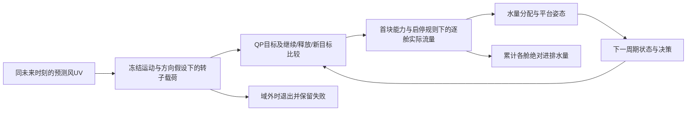

# 预测—决策—执行机制诊断 — 2026-10-05

## Material Passport

- Origin Skill/Mode: academic-research-suite / experiment-agent run + validate
- Origin Date: 2026-10-05；Version Label: thesis_mechanism_20261005
- Verification Status: VERIFIED（限定于同输入快照回放、原始积分复核和风窗口选择复现；不代表工程物理模型已验证）

## 主要判断

预测信息确实能改变当前压载目标和逐舱实际流量，但影响受到首块泵能力、启停死区、采样和目标分配共同限制。信息变化没有统一的“节泵”方向。五次同状态干预包含两次实际路径完全不变、一次只有动作时序变化、一次很小的执行量变化，以及一次明确的姿态—泵量权衡。当前证据没有证明同等合法信息下现有决策存在可避免损失，也没有证明需要多阶段控制或新的目标管理算法。

转子性能表的适用域是比预期更强的限制：初轮四例中，只有平稳例的三源均完成原定150分钟。失败记录保留；只在原四段风记录内缩短或改变共用起态，得到三个完整共同范围和一个80分钟共同有效前缀，没有新增独立环境、重训LSTM或改变权重。

原“大论文”对话接手后的补充结果见下一节。已进一步完成固定请求的执行消融、预测长度干预、已有合法候选实际运行，以及显式域外降级。结果没有支持立即开发随机/多阶段控制；明确的功能推进是原转向窗口在“13周期LSTM＋2周期Persistence”下完整运行。默认控制器与物理模型未因此更换。

## 接手后的有界补充结果

本轮全权接手后，旧执行对话已停止。所有仿真和分析由当前主对话完成；内部反方Agent Boyle使用gpt-6.1-sol/xhigh，只读审核设计和结论，没有另开用户对话、没有跑额外工况。复用原记录和克隆起态，未调权重或训练模型。

### 1. 固定请求，区分执行规则和规划效应

反方指出：改变死区后重新优化，同时改变了规划与执行，不能归因为纯执行差异。因此正式补充实验固定原新/旧请求，只将停止/启动阈值从300/500kg改为0/0kg，保留流量、驻留、时间步和真实外力。两点baseline固定请求物理路径均逐字段精确复现旧证据。

| 固定请求点 | 原阈值下新−旧首块泵量 m³ | 零阈值下新−旧 m³ | 说明 |
|---|---:|---:|---|
| 增强19:50 | 0.083333 | 0.166652 | 小目标差被软件阈值部分屏蔽，不是预测没有进入规划 |
| 平稳05:00 | 0.500000 | 0.460582 | 停泵时刻和末水量均受阈值影响，不能把变化算为设备改进 |

零死区不作为推荐参数。曾运行增强点1秒步长的重新优化探针，属于规划/载荷重建/执行共同变化的探索文件，不纳入纯执行归因，也没有继续扫描步长。

### 2. 只改变预测信息长度，不改变优化时域

六块QP、权重和当前观测不变，只在干预时刻把远端风向量改为当前观测持续性；之后均回到同一真实LSTM更新规则。“保留两点”序列可能在第二/第三端点制造过渡，已保存全序列和混合身份，不冒称原始LSTM。

| 同状态起点与后续长度 | 当次保留LSTM端点 | 实际泵量 m³ | 姿态RMS ° | 相对完整六点的结果 |
|---|---:|---:|---:|---|
| 转向06:00，80min | 6 | 133.666667 | 1.022164 | 共同基准 |
| 同上 | 2 | 133.333333 | 1.020520 | 少0.333333m³，RMS低0.001644°，末态不同 |
| 同上 | 0 | 133.416667 | 1.019369 | 少0.250000m³，RMS低0.002795°，末态不同 |
| 平稳05:00，90min | 6、2、0 | 均68.083333 | 均0.573561 | 实际流量路径完全相同；目标微差未穿透执行层 |

转向点确有有限窗口内两指标同时小幅改善，应保留这一正结果，不能因保守而抹掉。它不等于最佳预测长度或稳定算法优势。两点、零点臂回到基准末水量所需泵量下界分别为0.333333、0.416667m³，但**基准终态不是规定任务目标，不能把该下界加回成本后宣布收益消失**。其作用只是说明终态不同、长期后果未定。

### 3. 同合法信息下，实际执行一次已有释放候选

原规划中继续和释放候选首块都不泵水，新目标会泵水。只执行一次明确合法的释放，再恢复相同LSTM滚动策略，不加新控制律，不根据未来真实风挑赢家。

| 起点 | 策略 | 后续泵量 m³ | 姿态RMS ° |
|---|---|---:|---:|
| 转向06:00，80min | 原选择 | 133.666667 | 1.022164 |
| 同上 | 首块释放、随后恢复 | 122.833333 | 1.098950 |
| 平稳05:00，90min | 原选择 | 68.083333 | 0.573561 |
| 同上 | 首块释放、随后恢复 | 66.250000 | 0.652553 |

少泵伴随较差姿态和不同末态；没有出现同时改善。这里没有用六块名义成本排名与一块实际RMS排名不同来认定程序错误；名义预测与后续实际闭环不是同一评价问题。

### 4. 完整原转向窗口的显式降级能力

源码新增 `RotorPreviewOperatingDomainError(ValueError)`，保留原异常信息和数学行为，只提供明确域外类型与端点证据。诊断入口先尝试LSTM预览，仅未来端点域外时切换Persistence；当前/实际域外、状态错误和求解错误不会被当成预测域外静默吞掉。没有裁剪风速、外推性能表或改写偏航模型。**默认生产/连续实验入口仍不自动降级；本轮功能在明确命名的实验分支中。**

原04:50转向记录、共同原始起态、15周期150分钟：混合策略完整通过，13周期LSTM，2周期Persistence（index1的future6；index4的future3…6）。第一周期物理路径与旧LSTM精确一致，结构化异常未改变数值链路。五项聚焦测试全部通过。

| 原转向全窗口 | 泵量 m³ | RMS ° | 峰值横摇 / 纵摇 ° | 窗口内往返量 m³ |
|---|---:|---:|---|---:|
| Persistence | 248.166667 | 1.455137 | 1.880187 / 2.623582 | 5.666667 |
| LSTM＋显式域外Persistence降级 | 250.833333 | 1.457431 | 1.889501 / 2.623582 | 6.500000 |

这是完整运行能力的提升，不是控制收益。混合策略在本窗口泵量、RMS和横摇峰值均略差，但末水量也不同；不能把小差异泛化为预测无用，也不能称其优于持续性。更不能将13/15周期实际使用LSTM写成“纯LSTM完整通过”。

### 5. 对研究前提的进一步澄清

实际往返量可描述为：

\[
Q_{\rm round}=\sum_i\int |q_i(t)|\,dt-\sum_i|V_i(T)-V_i(0)|
=2\sum_i\min(Q_i^{\rm in},Q_i^{\rm out}).
\]

式中时间以分钟计，q以m³/min计。它是轨迹描述，不是坏动作评分。原12组条件窗口该量均为零；原完整转向窗口则如上表非零。不能把换向计数、释放动作直接当作无效泵送，也不能从短窗口水量单调推出长时域无往返。

另外，新QP只提交 `targets[0]`，首块目标受当前可达包络限制。它与旧版一次提出较远大目标、长期追踪的语义已不同。因此“大额未完成目标不断撤销”不能直接搬来作为新框架缺陷。已经发生的水量和泵状态仍是累积状态，但其代价是否值得专门做多阶段决策，需要新的问题依据。

**当前能支持的研究结论：** 预测作用存在明显的状态、约束与软件执行规则依赖；预览的数学长度不等于真正改变当前执行的信息长度。当前还没有确认超越合理简单基线的稳定新增机制。优先把模型可用范围、姿态要求和基线比较明确，再决定是否走决策导向预测或多阶段控制。

### 6. 运行告警与复现入口

NumPy2.2.6/Apple Accelerate在普通24×36与36×24随机float64矩阵乘法中复现同样的divide/overflow/invalid告警；该探针与不调用BLAS的einsum结果最大差为0，输出有限。官方亦有[同类告警记录](https://github.com/numpy/numpy/issues/29820)。这支持当前告警可能来自数值环境的判断，不是全部MPC运算已被独立证明正确。没有屏蔽告警、升级依赖或改成本公式。

新结果保存在 `artifacts/thesis_mechanism_diagnosis_20261005/followup/`；各分支保存完整路径、初末状态、来源身份和配置。`summary.json`由原始流量和姿态重新积分，不依赖单独显示的百分比。

运行入口为 `scripts/validation/run_thesis_mechanism_followup.py --stage execution|information|candidate|fallback`。复现脚本见该目录 `reproduce_followup.sh`。这四阶段使用原来的风记录，不是74个独立样本；没有批量训练、参数筛选或新场景树实现。

### 7. 选用预测权重与代码能力的事实修正

实际checkpoint的 `config`、外置 `lstm_config.json` 和run summary已核对：best epoch为16，残差回归启用，事件/方向损失权重各0.02。没有记录形状或规划器分块监督字段。训练脚本具备这些新选项，不等于当前权重已采用它们；此前规划将二者混写，已修正。

只读已有test输入与标签，按同一分量UV误差口径重算Persistence；LSTM列来自该目录已有历史指标，**不是本轮重新对全部test运行LSTM**。

| 时域 | 重算Persistence分量MAE m/s | 历史LSTM分量MAE m/s |
|---|---:|---:|
| 10min | 0.474260 | 0.462255 |
| 20min | 0.664158 | 0.638651 |
| 30min | 0.789307 | 0.755291 |
| 40min | 0.892790 | 0.851182 |
| 50min | 0.985114 | 0.937185 |
| 60min | 1.070035 | 1.014690 |
| 全六端点 | 0.812610 | 0.776542 |

142,915个已有test起点高度重叠，不是新增闭环工况或独立实验样本。此表不能与四案例的每向量欧氏误差直接混比，也不产生新的论文性能结论。它提示不能从三个局部窗口较差推断LSTM整体无预测能力；同时普通风预测误差的改善仍不自动转化为控制收益。当前权重、元数据和指标摘要保存在 `active_forecast_audit.json`。

### 8. 可执行的后续研究草案与北极星

已实现的最小更新是“可用的未来预览才进入原控制器，未来载荷明确越域时显式采用Persistence”。它有清楚的来源和失败边界，但属于运行基础，不声称是原创控制算法。

后续方法研究继续围绕组合映射：

\[
(z_k,\hat w_k)\ \longmapsto\ r_k^{*}\ \longmapsto\
\{q_{i,\ell}^{\rm actual}\}_{\ell\in\text{首块}}\ \longmapsto\
(\text{姿态轨迹},Q_{\rm abs}),\qquad z_k=(x_k,m_k,c_k).
\]

用于诊断的信息效应可以无额外权重地记录为：

\[
D(z_k;\hat w^a,\hat w^b)
=\sum_{i,\ell}|q^a_{i,\ell}-q^b_{i,\ell}|\Delta t_\ell/60,
\]

此处Δt以秒计，D单位m³。D不同于泵量差：三舱重新分配可能使D非零而总泵量不变。D为零只说明同初态、同外力、当前块实际动作无差异，不保证目标记忆或整个后续闭环等价。它是分析口径，不作为新的场景评分、训练损失或论文原创公式。

下一大工作包应按以下顺序落实，暂不继续扩本轮实验：

1. **明确姿态任务与载荷适用域。** 5°/10°是模型/设计范围，不直接充当工程可接受姿态要求。先冻结可接受的RMS、峰值或超过指定角度的时间，并明确研究只覆盖哪种风机运行状态。当前名义调度＋冻结偏航不能默认为全风速、全风向模型。
2. **校准强基线与预测身份。** 当前选用权重、Persistence、其他确实采用分块监督的权重分别登记；在同一平台、设备、姿态要求下做对照。先检查普通校准和已有监督能解释多少，而不把收益都归给新决策机制。
3. **只设计一个针对真实剩余问题的机制。** 若更新信息导致有意义的实际执行差异和不可瞬时撤销的代价，再考虑多阶段母体；若问题在控制相关预测误差，则评估DFL或其他预测使用机制。不同机制不能同时承诺，不能把本轮的小幅窗口差异升级为必要性证明。

核心指标不是任意加权分数下降，而是固定姿态要求下减少实际绝对泵量，或在相近泵送负担下改善姿态。末态不同必须披露，但不要求强行回到某条基准末态。新增机制应与修正后的当前方法和合理简单方法比较；能否形成原创控制算法，目前仍开放，不能通过增加公式或模块数量预先认定。

## 问题定义与实验身份（阶段 A）

研究问题：在同一平台、泵配置、控制目标与真实风况下，未来风序列怎样改变当前压载目标及实际执行？哪些差异源于信息质量、当前决策机制、执行规则或程序错误？本轮为有界模型内诊断，不以创新或节泵百分比为成功条件。

活跃链路：`real_lstm_preview_fixture.py` 加载 FINO1 test 数据和真实 LSTM → 选择预测风序列 → 同源转子载荷转换 → `preview_mpc_application.py` 装配平台/两维差动压载 QP → `preview_mpc_control_cycle.py` 比较继续原目标、释放到实际水量、追踪新目标 → 首块真实泵状态机预演与尾段 QP → 同一实测风重建的实际执行 → 滚动更新。

优先复用 `preview_mpc_continuous_experiment.run_variant`、既有 runtime 与聚合器。新增单一诊断入口 `scripts/validation/run_thesis_prediction_mechanism_diagnosis.py`；runtime 仅增加可选只读结果观察回调，保存原有结果对象的执行路径，不修改规划、候选排序、负载转换或泵规则。此前历史六小时结果存在于 `artifacts/preview_mpc_fixed_3case_semantic_v4_20260905.json`，本轮不直接将其当作新工况证据。

真实模型路径：`outputs/wind_prediction/lstm_segmented_fino1_meteo_aux_v1/lstm_best.pt`，配置为残差 LSTM、35 个输入、128 隐藏单元、1 层、6 个 10min 预测端点。数据入口为 `data/processed/wind_ml_10min/ballast_decision_fino1_meteo_aux_v1`，当前观测来自同一 test 样本。权重、数据与活跃源码摘要由现有 `implementation_identity()` 记录。

## 规则与边界清单

| 项目 | 当前实现 | 归类与依据 |
|---|---|---|
| 三舱进排海水、舱容、非负水量 | 每舱独立质量更新、裁切到 0…1,896,250 kg | 物理结构；几何和容量为当前参考配置，不是全船校准 |
| 累计泵量 | 逐舱实际质量增量绝对值/1025 积分，区别净质量变化 | 计量定义；诊断再用子步积分复核 |
| 泵能力 | 每舱 1 m³/min，600s 控制块，5s 子步 | 研究工作点；未核实具体工程泵的型号或实测曲线 |
| 泵档位 | runtime 覆盖为 `(0,1),(600,1)` 常速 | 旧默认 4…15 m³/min 分档曲线未在本轮活跃配置中使用 |
| 启停、保持 | stop 300kg、restart 500kg、min-on 20s、min-off 12s、near-target 10s | 可修改的软件规则；不能称为硬件必然限制 |
| 速率爬升 | 上升 2、下降 3 m³/min/s | 配置中的软件执行近似；5s 子步下通常一步可达 1m³/min |
| 换向和流量到目标裁切 | 流向按误差符号，流量按目标余量裁切 | 无独立机械换向、射流、阀门或惯性过程；不外推真实设备换向代价 |
| 目标质量 | 两差动模式的每块计划质量增量和为零；目标可以继承此前实际共同质量偏移 | 规划维度限制；不等于绝对目标总量始终等于参考总量，也不等于真实过程严格零总量 |
| 总质量范围 | 等效升沉 0.01m，对完整首块路径检查 | 暂定模型工作范围；不是船级或设备限制 |
| 姿态范围 | nominal roll/pitch 5°；pitch 可用有代价 slack 到 10°；roll 5° | v4 研究范围，非已校准的海上安全界限 |
| 平台动力学 | 12维低阶系统，随水量更新质量/恢复模型；WAMIT 局部辐射阻尼，pitch 衰减 0.4%等效阻尼向roll推广 | 来源和对称性近似分开；不是六自由度完整验证 |
| 预测运动/方向 | future velocity=0；偏航按当前风理想对齐、未来冻结 | 信息源共用的模型假设，不含偏航执行器动态 |
| 实际风载 | 10min 实测 ENU 向量线性重建到5s中点；相对来流使用每块初始平台运动 | 随分叉平台状态在下一块自然分化，块内运动反馈被冻结 |
| 波浪与其他扰动 | 显式零载荷 | 限定纯风诊断，不能外推海况收益 |
| 控制器记忆 | 每周期重建 application/OSQP，无 warm start；上一块净舱量变化在 execution state | 快照涵盖所有 execution dataclass 字段和平台状态；仍以同输入完整回放验证 |

历史泵曲线确有以改善收敛为目的的软件调节记录：`docs/archived/legacy/legacy_program_changelog.md` 的 2026-03-03 14:51 条目（约4090行）。这只说明历史规则来源；当前1m³/min常速工作点不可归因为该分档曲线。

## 实验选择与因果设计（阶段 B/C）

先只看真实风序列，扫描连续 test 记录，选增强、增强后回落、转向、平稳四类；不看泵量或控制结果排名。选择证据保存在 `artifacts/thesis_mechanism_diagnosis_20261005/wind_selection.json`。每例主体2小时，追加相同实测风的30分钟尾段；三个信息源各运行15周期，均使用6块预测时域和完全相同参数。各源保留自身后续信息规则，因此这是全程换预测源的对照，不与一次更新干预混称。

每例从 LSTM 轨迹中选择公共未来时域风向量更新最大的一个时刻，克隆完整状态并确认同输入完整证据精确重放。一次干预将前一预测的 lead 2…6 对齐当前 lead 1…5；当前 lead6 在两臂都使用新预测，当前观测和可靠性不变，随后均回到同一真实 LSTM 生成规则。分叉实际风始终使用相同 recorded wind，平台状态不同允许负载转换依现有物理模型自然分化。

Recorded future 仅是现有冻结方法对真实未来风信息的离线反应，不是理论最优上限。无同等合法信息的合理替代决策证据时，不得推论可避免损失。

上述为初轮预声明设计。运行后的资格变化如下，不能把有效子窗口冒称原始全程完成。FINO1时刻保持数据文件中的原标签，不作时区换算。

## 初轮运行资格与适用域反例

| 原风记录起点 | 工况 | Persistence有效周期 / 15 | LSTM | Recorded future | 退出位置与原因 |
|---|---|---:|---:|---:|---|
| 2022-04-18 19:00 | 增强 | 0 | 0 | 0 | 首块实际风载转换失败，风速短时降至4.14m/s，名义最小转速对应叶尖速比超出性能表上界14.5 |
| 2024-03-07 20:50 | 增强后回落 | 13 | 13 | 8 | 前两源在实际风载第13周期退出；Recorded future在第8周期的第6预测端点先触及叶尖速比域外 |
| 2024-02-14 04:50 | 转向 | 15 | 1 | 0 | LSTM第1周期、Recorded future第0周期的预测端点域外；实际Persistence路径仍可运行 |
| 2022-04-17 04:00 | 平稳 | 15 | 15 | 15 | 无退出 |

这些事件的记录原因均为 `rotor_operating_model_out_of_domain`。没有证据将它们归成求解器错误、泵故障或某算法较差。未来风虽已知，未来机舱方向仍冻结于当前值、未来平台速度仍为零；风向转变可能降低预测轴向来流，使名义转速对应叶尖速比超出表范围。实际执行每周期重新按当前风理想对齐，因此预测与实际载荷的适用域可能不同。**完美风序列不等于完美未来转子载荷。** 已有源码明确保留这些假设，本轮不裁切风或外推性能表来隐藏退出。

只按同一风记录内的模型适用性作必要补充：增强从原index3（19:30）作共同局部静态初始化，主体90分钟+尾段30分钟；转向从原Persistence index5（05:40）的完整状态共用起步，主体70分钟+尾段30分钟。它们是条件子窗口，特别是转向子窗口不代表三源均预测并控制了最初转向过程。回落仅比较三源共同完成的前8周期80分钟，保留后续退出且不宣称已控制了整个低风速回落尾部。

## 同范围的信息源结果

RMS为5s采样的 `max(abs(roll),abs(pitch))` 的时间RMS，单位°；泵量为逐舱实际进排水绝对量，单位m³。两列同时展示主体与含尾段结果，避免把延后动作当作节省。不同工况时长和起态不同，不跨工况汇总收益。

| 工况（主体+尾段） | 信息源 | 主体泵量 | 主体RMS | 含尾段泵量 | 含尾段RMS |
|---|---|---:|---:|---:|---:|
| 增强（90+30min） | Persistence | 173.917 | 2.5042 | 231.917 | 2.3694 |
| 同上 | 真实LSTM | 175.583 | 2.4958 | 233.583 | 2.3582 |
| 同上 | Recorded future | 175.333 | 2.4918 | 233.333 | 2.3635 |
| 回落（80min共同前缀，无统一尾段） | Persistence | 156.083 | 2.8641 | — | — |
| 同上 | 真实LSTM | 156.167 | 2.8641 | — | — |
| 同上 | Recorded future | 151.667 | 2.8666 | — | — |
| 转向条件子窗（70+30min） | Persistence | 134.000 | 1.1842 | 170.333 | 1.0457 |
| 同上 | 真实LSTM | 135.000 | 1.1867 | 172.667 | 1.0461 |
| 同上 | Recorded future | 110.667 | 1.2493 | 168.667 | 1.1178 |
| 平稳（120+30min） | Persistence | 191.083 | 1.0433 | 193.750 | 0.9575 |
| 同上 | 真实LSTM | 183.583 | 1.0486 | 184.750 | 0.9661 |
| 同上 | Recorded future | 194.667 | 1.0421 | 198.333 | 0.9546 |

反例一：转向子窗口Recorded future主体比Persistence少泵23.333m³，但追加尾段后差值只剩1.667m³，且RMS更高。主体少泵大部分是动作延后，不能称长期节泵收益。反例二：增强中LSTM比Persistence多泵而姿态稍好；平稳中LSTM少泵而姿态稍差。这里没有某源同时稳定减少泵量、改善姿态的支配关系。

风序列本身的公共6端点UV欧氏平均误差（Persistence / LSTM，m/s）：增强0.870 / 0.706，回落1.529 / 1.849，转向子窗0.818 / 1.105，平稳0.236 / 0.259。只有这组增强窗口中LSTM的该指标更低。它只是四个定向窗口的风误差，不能替代控制效用、模型适用性或总体预测精度判断；Recorded future该指标为零是构造事实。

## 五次同状态因果回放

所有分叉均保存平台及执行状态全部字段，并在原始新预测输入下复现整份规划、执行和路径证据，五次均精确一致。下表“新−旧”仅指该次对齐更新干预；公共未来5个时刻明确记录，第6端点共用新值。选点依据为公共风端点更新大小；额外转向过程点05:20选在已检查合法的转向阶段，使用共同Persistence前缀，不以节泵结果挑点。

| 工况与干预时刻 | 公共5端点平均UV更新 m/s | 首块实际流量变化 | 后续累计泵量新−旧 m³ | 后续RMS 新 / 旧 ° | 因果解释 |
|---|---:|---|---:|---|---|
| 增强 2022-04-18 19:50 | 1.508 | 仅1个5s子步变化，首块+0.0833m³ | +0.0833 | 2.39417 / 2.39419 | 小目标差跨过离散停泵时刻；不是宏观节泵 |
| 回落 2024-03-07 21:50 | 1.328 | 完全相同 | 0 | 0.86822 / 0.86822 | 首块计划与提交目标完全相同，位于泵可达增量边界；有效共同7周期完全一致，之后两臂均域外终止 |
| 转向子窗 2024-02-14 06:00 | 1.176 | 14个5s子步逐舱分配变化，首块总量相同 | +13.1667 | 1.02216 / 1.11334 | 分配先改变姿态，滚动后改变后续目标/累计泵量；明确权衡 |
| 转向过程 2024-02-14 05:20 | 0.935 | 完全相同 | 0 | 1.12287 / 1.12287 | 首块±10,164.58kg边界饱和；0.013kg以内目标微差属数值容差量级，未转化为流量 |
| 平稳 2022-04-17 05:00 | 0.317 | 3个5s子步变化，首块+0.5m³ | 0 | 0.57356 / 0.57462 | 动作时间前移，后续补偿后累计量和末端水量相同；不能用首块差推累计收益 |

回落分叉的后续统计是70分钟共同有效前缀，`comparison_eligible=false`，只说明该前缀里没有响应差异，不是原150分钟经济性结果。转向过程05:20分叉仅当次采用新/旧LSTM，之后两臂均使用Persistence；其他分叉之后均采用共同真实LSTM规则。二者是不同条件实验，数据中已明确标记。独立审查发现05:20的一处说明仍误写随后LSTM，已更正描述并保留原说明字段；数值与状态证据未改变。

具体机制：

- **目标改了但没执行：** 增强19:50第一舱新目标增量+85.42kg，旧约0kg，均未达到500kg启动阈值，第一舱没有进水；转向05:20的大舱动作已经抵达可达边界，其他差异仅0.013kg，实际路径完全一致。前者为软件启停规则，后者为首块能力饱和兼数值容差，不能直接称预测无价值。
- **执行变了但总量没变：** 转向06:00首块旧/新实际质量变化分别约 `[-8200,+9993.75,-1622.92]` 与 `[-8797.92,+9993.75,-1025]` kg；两者同为19.333m³，但排水在第一/第三舱之间重新分配，力矩和姿态不同。随后新预测臂累计更多泵量换取更低RMS。
- **首块多泵不是累计多泵：** 平稳05:00新预测比对齐旧预测首块多0.5m³，余下9周期累计均68.0833m³，末端实际水量完全相同。姿态过程仍略有差异，体现时序而非总量效应。
- **大预测变化不一定改动作：** 回落21:50风预测公共端点平均更新1.328m/s，但首块计划、提交目标、实际水量和姿态全相同，首块±10,164.58kg可达边界约束活跃。这里不能从目标未变化推出信息未接线。

## 末态与归因边界

五个分叉的两臂共同末态实际流量均为零，但不能据此称完成了同一工作。完整目标、锁存、计时与平台运动均保留。

- 增强末端实际质量新−旧为 `[0,-85.42,0]` kg，目标也不同，0.0833m³差与这点余量一致，不能宣称节能改善。
- 转向06:00末端实际质量新−旧约 `[-3502.08,+6833.33,-3160.42]` kg，是不同的差动补偿终态。旧臂少泵13.167m³却姿态更差，不构成同姿态要求下的可避免损失证据。
- 回落和05:20转向分叉末态质量完全一致；平稳末态质量一致但末目标约差38.56kg。各选点原目标剩余量最大269.36kg，均小于300kg停止阈值，没有看到大额未完成目标被持续中断而制造明显额外泵量。
- 完整三源共同窗口的末端残余目标绝对值为0…213.444kg/舱，处于停止死区内。此范围由保存的12组末态逐舱重算；之前写为132…235kg不准确，已纠正。有限尾段没有强制终态一致，因此总体源对照仍需按姿态—泵量—末态三者共同解释。



## 软件、信息、决策与执行的分类结论

| 类别 | 已证实 | 未证实 / 不应推论 |
|---|---|---|
| 软件错误 | 诊断工具曾有日志索引、越域汇总、空分支与一处后续信息描述问题，均已修正；iCloud占位输入导致启动IO延迟，已恢复 | 本轮未定位到足以解释控制收益的活跃控制器数值/时间对齐错误；工具修复不算研究创新 |
| 信息质量 | 同状态UV更新可以因果改变逐舱执行；四窗口中LSTM风误差和控制收益方向不同 | 更准风信息不保证更少泵或更好姿态；Recorded future不是性能上限 |
| 决策机制 | 单路径QP和三个既有生命周期候选已在工作，滚动状态分化会改变后续动作 | 未看到同合法信息的合理替代机制同时保姿态、少泵；未证明新目标管理或多阶段控制必需 |
| 执行与模型 | 1m³/min首块能力、软件启停死区及5s离散规则可屏蔽目标差；逐舱分配和时序有作用；性能表域与冻结偏航限制强 | 这些软件阈值和近似不是实测设备必然特性；累计泵量不直接等同能耗、寿命或工程安全收益 |

## 研究路线判断与有限下一步

**预测改进有局部问题依据，但不能只按平均风误差选方法。** 三个窗口LSTM的UV误差比Persistence高；应先明确与可用转子载荷、慢泵时间尺度相关的误差/事件指标，并处理当前明确的名义工作域限制。需要新的独立样本才能判断推广性，本轮不自动启动10/20/30组。

**目标管理尚无优先开发依据。** 当前已经比较继续、释放和新目标，五处因果点原余量都在停止死区内，未发现“大额未完成任务不断被替换”解释额外负担。下一步若有这样的真实轨迹，再检验它是否在同姿态/末态条件下造成额外往返量。

**多阶段控制尚缺问题证据。** 本轮没有模拟未来信息分支和追索决策，也没有证明现有单路径决策在同等合法信息下被合理替代策略支配。应先指定一个合法、可部署的小替代决策，比较相同姿态要求、设备约束与末态工作；只有证明该类不可逆首块动作损失，才进一步评估多阶段结构。

**执行近似敏感性有直接问题依据。** 0.0833m³的一子步差和500/300kg阈值屏蔽差异已可观测，且爬升在5s下基本一步到额定。后续可做一次有理由的执行规则/时间步敏感性，区分研究结论是否依赖历史软件规则；不先承诺紧凑执行模型，也不把阈值效果包装为设备物理困难。

本轮到达的证据层级为：源码与运行身份 → 预测已接线 → 完整状态下的信息更新因果效应 → 姿态/泵量/末态的条件响应。尚未到达“现有机制的可避免损失”或“新算法的稳定优势”。这个边界是结果，不是必须继续扩样或制造创新的理由。

## 复现与实际验证

工作目录为 `/Users/saintyoung/Desktop/FOWT-CONTROLLER-main`，运行环境Python3.12.14、Torch2.8.0、NumPy2.2.6，OSQP复用仓库 `.venv312` 中已有1.1.3模块。控制设计为 `research_preview_mpc_design_v4`，参数SHA-256：`3e1d3a206fce891be2f7816931e63ffcf855e0cc148c319cfdf5e0d2ee796f97`。两轮活跃controller/platform源码与模型输入摘要完全一致，没有调权重。初始与最终诊断代码归档分别保留，后者包含只改说明的修复。

```sh
cd /Users/saintyoung/Desktop/FOWT-CONTROLLER-main
/usr/bin/python3 artifacts/thesis_mechanism_diagnosis_20261005/select_wind_windows.py
zsh artifacts/thesis_mechanism_diagnosis_20261005/reproduce.sh
zsh artifacts/thesis_mechanism_diagnosis_20261005/reproduce.sh --recover-subwindows
/usr/bin/python3 artifacts/thesis_mechanism_diagnosis_20261005/analyze_evidence.py
```

已实际通过：风选择文件逐字节复现；五次同输入完整证据精确回放；转向子窗Persistence与原Persistence后缀逐周期完全一致（只对齐日志索引）；所有保存的有效路径从原始流量重新积分，质量守恒、姿态平方积分、泵事件计数和1m³/min流量边界均通过。当前仍未做干净新机器上的全量重建，也未进行高保真动力学校准。

原环境和输入是iCloud `dataless` 占位文件。进程采样定位到文件读阻塞后，通过[Apple FileManager下载接口](https://developer.apple.com/documentation/foundation/filemanager/startdownloadingubiquitousitem%28at%3A%29)恢复所需文件，未删除、改写或重新训练原数据/权重。该问题已解除。

独立只读反方审查实际进行了工具核查和结果复核。补充记录见证据目录 `independent_readonly_review.md`。统计/方法谬误检查11/11：不做跨工况总体平均（Simpson）；不作个体或工程总体推断（ecological）；工作域筛选仍是条件选择（Berkson、collider风险明确）；无分类率声明（base-rate不适用）；不把回落自然变化称控制收益（regression-to-mean）；保留全部退出和分母（survivorship）；报告全部固定例和负面结果、无显著性筛选（look-elsewhere）；保存初版失败和子窗理由、不调权重（forking-paths）；跨周期只称现象、因果限于克隆干预（correlation）；干预先于执行且外生风相同（reverse causality）。

## 证据索引

- `artifacts/thesis_mechanism_diagnosis_20261005/analysis_summary.json`：原资格、四共同范围、五分叉及独立积分复核。
- `comparison_metrics.csv`：12行三源结果，主体/尾段/风误差分列。
- `*_sources.json`：真实LSTM、实测观测、适用域明细与原始时间。
- `*_{persistence,lstm,recorded_oracle}.json.gz`、`*_subwindow_*.json.gz`：候选、约束、提交目标、完整起末状态和5s逐舱路径。
- `*_fork.json.gz`：完整克隆快照、公共未来时刻、同输入重放、干预及逐周期后果；05:20新臂额外保存在 `turning_during_turn_new_forecast_baseline.json.gz`。
- `frozen_identity.json`、`subwindow_identity.json`：两轮实际执行身份；`frozen_code.tar.gz`、`final_diagnostic_code.tar.gz`：源码/config快照。
- `run.log`、`subwindow_run.log`、`evidence_sha256.json`、`reproduce.sh`：命令结果、摘要与恢复入口。
